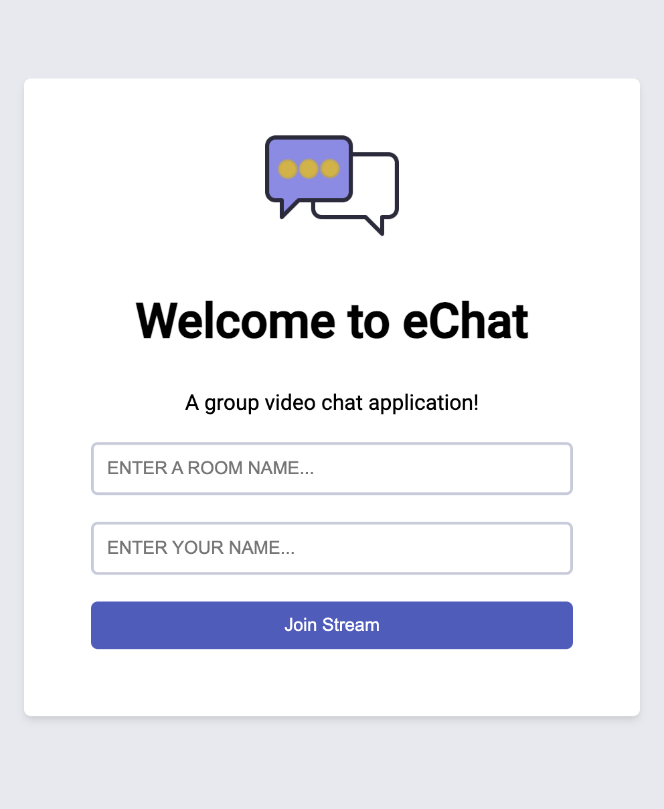

# eChat: Real-Time Video Chatting Web App (Django & Agora Web SDK)

- Seamless video chat, enabling effortless group and peer-to-peer video calls directly within your web browser.
- Built with the Django framework and leveraging the Agora Web SDK for exceptional video and audio quality, eChat provides a robust and user-friendly platform for real-time video conferencing.
- Enjoy a user-friendly experience with clear controls for muting your microphone, turning your camera on/off, and displaying participant names.

